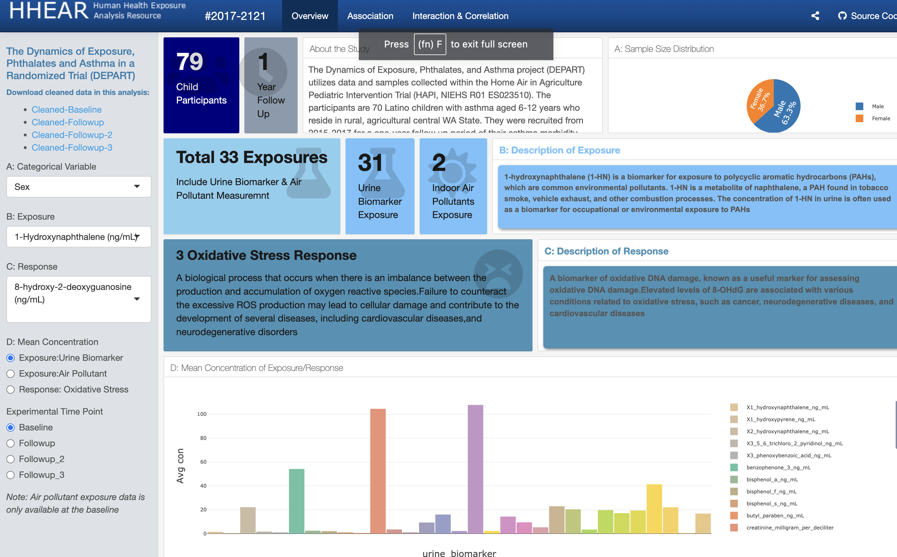
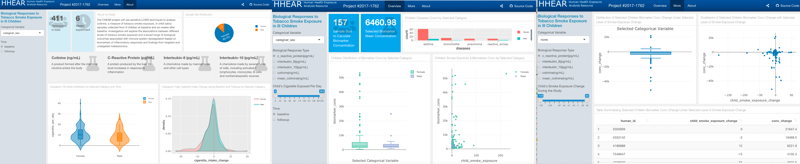
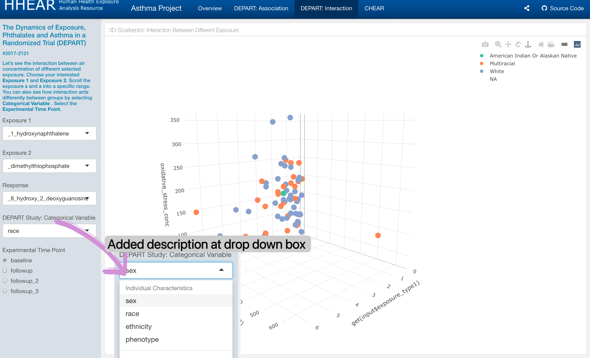

# 1.Self Introduction and Skills

### Know more about Sallie !

# 2.Shiny App, Dashbaord & Tableau

### Shiny App 
Establishing a Shiny app for a decision-making team can offer several benefits, including:

* Real-Time Updates: Shiny apps can be configured to update in real-time, so decision-makers can see the latest data and insights without having to wait for reports or manual updates.

* Collaborative Decision-Making: Shiny apps can be shared with team members, stakeholders, and other decision-makers, allowing for collaborative decision-making. This can lead to more informed decisions that are based on a broader range of perspectives and insights.

* Increased Efficiency: With a Shiny app, decision-makers can access the data they need quickly and easily, without having to spend time gathering and analyzing data from different sources. This can lead to faster and more efficient decision-making.

I am responsible for HEEAR to design Shiny App for interactive analysis dashboard to facilitate investigator decision making. I will establish hypothesis-free exploratory analyses to uncover unforeseen trends. Here are two examples.

* **Example 1: [Biological Responses to Tobacco Smoke Exposure in Ill Children](https://hhear.shinyapps.io/dashboard1/)** 

* **Example 2: Asthma Project**

### Tableau 
 Tableau is a powerful data visualization tool that allows users to create interactive and visually appealing charts, graphs, and dashboards. I am currently preparing for the exam *Tableau Desktop Specialist*. Attached is one of my learning works using Tableau. 
 
 * **[Netflix](https://public.tableau.com/app/profile/sallietsang/viz/Netflix_16776310893610/Netflix)**

### Webiste 
* **[DO YOU SMOKE?](https://lscelia.github.io/Smoking_in_US/index.html)**

I have created a website with my classmates names *DO YOU SMOKE* generalizing the smoking situation in the State over the past 5 years. The website concludes the characteristics of smokers and people who quit smoking in the United States, as well as
the specific populations which need more attention. We built the website with the following motivation: 

* Public Health Education: A website about the US smoking situation could be created to educate the public about the risks and harms associated with smoking. This could include information on the health effects of smoking, statistics on smoking rates and related diseases, and resources for quitting smoking.

* Research and Data Collection: A website could be created to compile and share research and data on smoking rates, trends, and related issues. This could be useful for researchers, policymakers, and public health professionals looking to better understand the impact of smoking on the US population.

### Dashboard 

* **[Airbnb](dashboard1.html)**
* **[Instacart](dashboard2.html)**
* **[NYC Precipiatation](dashboard3.html)**

# 3.Predictive Modelling 

* **[Parkinson’s Disease Prediction](machinelearningproject.html)**

* Built 8 Supervised Machine Learning Models (LASSO, Ridge, GAM, MARS, GBM, SVR, Random Forest) to predict
Parkinson’s Disease severity based on patients’ age, sex, and vocal features
* Tuned model parameters, compared performance, and selected RF model with smallest 10-fold cross-validated RMSE

# 4.Resume
If you interested in my academic and professional experience, let's click into my **[Resume](Resume.html)** page.

